# Laporan Proyek <i>Machine Learning</i> - Yuda Hendriawan Budi Handoko

## Domain Proyek


Proyek ini akan berfokus pada domain Real estate / Properti yaitu membahas mengenai prediksi harga rumah. Masalah prediksi harga rumah penting untuk diselesaikan karena memiliki dampak besar pada berbagai aspek, baik untuk individu, bisnis, maupun pemerintah. Bagi masyarakat umum, model prediksi harga rumah membantu menciptakan transparansi di pasar properti, sehingga pembeli dan penjual memiliki gambaran yang lebih objektif mengenai nilai rumah yang akan diperjualbelikan. Hal ini mengurangi asimetri informasi yang sering kali menyebabkan transaksi tidak adil atau keputusan finansial yang kurang bijak. Dari sisi bisnis, agen properti, pengembang, dan investor sangat bergantung pada estimasi harga untuk merumuskan strategi penjualan, pembelian, dan investasi agar dapat memaksimalkan keuntungan dan meminimalkan risiko kerugian. Selain itu, pemerintah dan perencana kota juga sangat diuntungkan dari ketersediaan data prediksi harga, karena informasi ini membantu dalam merumuskan kebijakan publik seperti pajak properti, subsidi perumahan, hingga perencanaan zonasi wilayah. Lebih jauh lagi, analisis harga rumah berperan penting dalam upaya menciptakan akses perumahan yang lebih adil, terutama dengan mengidentifikasi daerah-daerah yang mengalami kenaikan harga secara tidak wajar yang dapat berpotensi menimbulkan gentrifikasi. Pada akhirnya, prediksi harga yang akurat tidak hanya meningkatkan efisiensi pasar dengan mengurangi proses negosiasi yang panjang, tetapi juga memperkuat stabilitas pasar properti secara keseluruhan.

Beberapa riset menjelaskan bahwa masalah keterjangkauan perumahan menjadi isu mendesak karena tingginya biaya sewa, keterbatasan pasokan rumah, dan tingginya biaya pinjaman telah semakin menyulitkan akses masyarakat, terutama kelompok berpenghasilan rendah, generasi muda, keluarga dengan anak, dan lansia, untuk mendapatkan tempat tinggal yang layak. OECD (2024) mencatat bahwa meskipun harga rumah sempat menurun usai pandemi COVID-19, beban finansial masyarakat justru meningkat akibat biaya pinjaman yang tinggi, memperburuk risiko ketidaksetaraan sosial dan bahkan meningkatkan angka tunawisma. Oleh karena itu, intervensi kebijakan publik seperti penguatan perumahan sosial, regulasi pasar, dan dukungan bagi kelompok rentan sangat penting untuk menciptakan akses perumahan yang lebih adil dan berkelanjutan (OECD, 2024). Lebih dari sekadar masalah keterjangkauan akibat biaya sewa dan pinjaman yang tinggi, krisis harga perumahan di Indonesia mendesak untuk dibahas karena adanya ketidakseimbangan fundamental antara kurangnya pasokan rumah yang signifikan dibandingkan dengan permintaan yang terus meningkat, diperparah oleh kuatnya preferensi masyarakat terhadap rumah tapak (East Asia Forum, 2024). Selain itu, efektivitas program pemerintah seperti Tapera dalam mengatasi masalah ini masih dipertanyakan, menimbulkan kekhawatiran terkait tata kelola dan kepercayaan publik. Lebih lanjut, artikel tersebut menyoroti perlunya fokus pada pengendalian spekulasi harga tanah melalui penguatan peran Bank Tanah sebagai langkah krusial untuk menstabilkan pasar properti dan memastikan ketersediaan rumah yang lebih terjangkau bagi masyarakat luas.

Oleh karena itu, laporan ini mengeksplorasi solusi permasalahan harga rumah melalui pendekatan <i><i>Machine Learning</i></i> yaitu mengaplikasikan proses regresi untuk memprediksi harga rumah berdasarkan kriteria-kritera tertentu. Prediksi harga rumah menggunakan metode ini menawarkan analisis mendalam dengan memanfaatkan beragam data, sehingga berpotensi memberdayakan berbagai pihak untuk memahami dan merespons dinamika pasar perumahan secara efektif.

## Business Understanding

### Problem Statements

1. Identifikasi Fitur Properti yang Paling Berpengaruh Terhadap Harga Rumah

Dari berbagai fitur yang melekat pada sebuah properti, seperti jumlah kamar tidur dan kamar mandi, dan nilai penghasilan area tersebut, fitur mana sajakah yang memiliki pengaruh paling signifikan terhadap fluktuasi harga rumah di pasar tertentu? Memahami hierarki pengaruh fitur-fitur ini akan membantu dalam memberikan bobot yang tepat dalam model prediksi dan mengidentifikasi aspek-aspek kunci yang paling diperhatikan oleh pasar.

2. Estimasi Harga Pasar Rumah Berdasarkan Karakteristik Tertentu

Berapakah perkiraan harga pasar untuk sebuah rumah dengan karakteristik atau fitur spesifik? Misalnya, berapa estimasi harga untuk rumah dengan luas bangunan 150 m², luas tanah 200 m², berlokasi di Surabaya Barat, memiliki 3 kamar tidur dan 2 kamar mandi? Kemampuan untuk secara akurat memperkirakan harga berdasarkan kombinasi fitur yang berbeda akan sangat berguna bagi calon pembeli, penjual, investor, dan lembaga keuangan dalam melakukan valuasi properti.

### Goals

1. Menentukan Tingkat Signifikansi Setiap Fitur Properti dalam Mempengaruhi Harga

Tujuan dari pernyataan masalah ini adalah untuk mengidentifikasi dan mengukur tingkat pengaruh setiap fitur properti terhadap harga jual rumah. Melalui analisis <i>Machine Learning</i>, kita akan dapat menentukan fitur mana yang memiliki korelasi terkuat dan kontribusi terbesar dalam memprediksi harga akhir. Hasil ini akan memberikan wawasan penting mengenai preferensi pasar dan faktor-faktor yang paling dihargai oleh pembeli.

2. Mengembangkan Model Prediksi Harga yang Akurat Berdasarkan Kombinasi Fitur

Tujuan dari pernyataan masalah ini adalah untuk membangun sebuah model <i><i>Machine Learning</i></i> yang mampu memprediksi harga pasar rumah secara akurat berdasarkan input karakteristik atau fitur properti yang spesifik. Model ini diharapkan dapat memberikan estimasi harga yang realistis dan berguna sebagai referensi dalam transaksi jual beli properti, pengambilan keputusan investasi, dan penilaian aset oleh lembaga keuangan.

### Solution Statements

Untuk mencapai tujuan yang telah diidentifikasi dalam menjawab pernyataan masalah, diusulkan dua pendekatan solusi utama berbasis <i>Machine Learning</i>:

1. Pengembangan Model Prediksi Harga Rumah dengan Berbagai Algoritma <i>Machine Learning</i>

Untuk mencapai tujuan dalam memprediksi harga rumah secara akurat dan mengidentifikasi pengaruh fitur, solusi yang diajukan adalah dengan mengembangkan dan membandingkan kinerja beberapa algoritma <i><i>Machine Learning</i></i> yang relevan. Algoritma yang akan diimplementasikan meliputi:

- Random Forest: Ensemble learning yang kuat dan dikenal efektif dalam menangani data dengan banyak fitur dan interaksi non-linear.
- AdaBoost (Adaptive Boosting): Algoritma boosting yang fokus pada perbaikan kesalahan prediksi oleh model-model lemah secara iteratif, sehingga berpotensi meningkatkan akurasi prediksi.
- Multilayer Perceptron (MLP): Jaringan saraf tiruan feedforward yang mampu memodelkan hubungan yang kompleks antara fitur dan target, serta dapat menangkap pola non-linear.
- Support Vector Machine (SVM): Algoritma yang efektif dalam ruang fitur berdimensi tinggi dan dapat digunakan untuk regresi (SVR - Support Vector Regression) dalam memprediksi nilai kontinu seperti harga rumah.

Selanjutnya, kinerja setiap model akan dievaluasi menggunakan metrik regresi yang relevan seperti Mean Squared Error (MSE) karena ini merupakan metrik yang paling mudah untuk dipahami secara high-level dimana metrik ini akan mem-<i>punished</i> kesalahan-kesalahan yang terjadi selama proses training menjadi lebih besar. Misalnya, jika kesalahannya 1 maka errornya tetap 1, namun ketika kesalahannya 10, maka errornya akan menjadi 100 dimana akan memberikan hukuman yang maksimal sehingga model dapat belajar lebih baik.
Berikut adalah rumus dari Mean Squared Error:


2. Peningkatan Kinerja Model Prediksi Melalui Hyperparameter Tuning

Setelah mengidentifikasi algoritma dengan kinerja terbaik atau beberapa kandidat model yang menjanjikan, langkah selanjutnya adalah melakukan hyperparameter tuning. Proses ini melibatkan pencarian kombinasi nilai hyperparameter optimal untuk setiap algoritma guna memaksimalkan kinerja prediksi. Teknik tuning yang akan digunakan adalah Grid Search. Grid Search akan melakukan pencarian menyeluruh melalui sekumpulan hyperparameter yang telah ditentukan, dimana diharapkan akan ditemukan kombinasi-kombinasi hyperparameter yang menghasilkan kesalahan minimum. 

## Data Understanding

Bagian ini menyajikan deskripsi rinci mengenai data yang dipergunakan dalam proyek prediksi harga rumah. Sumber utama dari data ini adalah dataset "California Housing Price" yang tersedia secara publik melalui library Scikit-Learn [Fetch California Housing Dataset](https://scikit-learn.org/stable/modules/generated/sklearn.datasets.fetch_california_housing.html) yaitu:

```
from sklearn.datasets import fetch_california_housing
```

Dataset "California Housing Prices Dataset" menyediakan beragam atribut yang mencirikan properti residensial, yang relevan untuk analisis faktor-faktor penentu harga rumah. Variabel-variabel utama yang terdapat dalam dataset ini adalah sebagai berikut:

- MedInc: Median income dalam blok, satuan 10.000 USD.
- HouseAge: Median house age dalam blok, satuan tahun.
- AveRooms: Rata-rata jumlah ruangan per rumah tangga dalam blok.
- AveBedrms: Rata-rata jumlah kamar tidur per rumah tangga dalam blok.
- Population: Jumlah total penduduk dalam blok.
- AveOccup: Rata-rata jumlah penghuni per rumah tangga dalam blok.
- Latitude: Lintang geografis blok dalam derajat.
- Longitude: Bujur geografis blok dalam derajat.
- MedHouseVal: Median house value dalam blok, satuan 100.000 USD. (Target variabel)

Dataset ini terdiri dari 8 fitur independen dan 1 target fitur dan 20640 sampel data

## Exploratory Data Analysis

### Info dataset dan Cek Missing Value

Selain deskripsi variabel diatas, akan digunakan built-in function dari pandas yaitu `info()` untuk mengecek apakah ada missing value pada setiap kolom dan juga tipe dari setiap kolom/fitur dan didapatkan hasil sebagai berikut:

```
<class 'pandas.core.frame.DataFrame'>
RangeIndex: 20640 entries, 0 to 20639
Data columns (total 9 columns):
 #   Column       Non-Null Count  Dtype  
---  ------       --------------  -----  
 0   MedInc       20640 non-null  float64
 1   HouseAge     20640 non-null  float64
 2   AveRooms     20640 non-null  float64
 3   AveBedrms    20640 non-null  float64
 4   Population   20640 non-null  float64
 5   AveOccup     20640 non-null  float64
 6   Latitude     20640 non-null  float64
 7   Longitude    20640 non-null  float64
 8   MedHouseVal  20640 non-null  float64
dtypes: float64(9)
memory usage: 1.4 MB
```
Dapat dilihat bahwasannya semua fitur/kolom memiliki jenis tipe data numerik dan tidak terdapat missing value.

Selain menggunakan fungsi `info()`, akan dicek data statistik berupa mean, min, max, Q1, Q3 dan lain-lain untuk memastikan tidak ada missing value yang tersembunyi seperti misalnya nilai-nilai non-negatif atau nila tak wajar, dan didapatkan hasil sebagai berikut

```
MedInc      HouseAge      AveRooms     AveBedrms    Population  \
count  20640.000000  20640.000000  20640.000000  20640.000000  20640.000000   
mean       3.870671     28.639486      5.429000      1.096675   1425.476744   
std        1.899822     12.585558      2.474173      0.473911   1132.462122   
min        0.499900      1.000000      0.846154      0.333333      3.000000   
25%        2.563400     18.000000      4.440716      1.006079    787.000000   
50%        3.534800     29.000000      5.229129      1.048780   1166.000000   
75%        4.743250     37.000000      6.052381      1.099526   1725.000000   
max       15.000100     52.000000    141.909091     34.066667  35682.000000   

           AveOccup      Latitude     Longitude   MedHouseVal  
count  20640.000000  20640.000000  20640.000000  20640.000000  
mean       3.070655     35.631861   -119.569704      2.068558  
std       10.386050      2.135952      2.003532      1.153956  
min        0.692308     32.540000   -124.350000      0.149990  
25%        2.429741     33.930000   -121.800000      1.196000  
50%        2.818116     34.260000   -118.490000      1.797000  
75%        3.282261     37.710000   -118.010000      2.647250  
max     1243.333333     41.950000   -114.310000      5.000010  
```

Dapat dilihat bahwasannya hasilnya bagus tidak ada nilai missing yang tersembunyi seperti yang dikhawatirkan.

### Mengecek Outlier

Untuk mengecek outlier, akan digunakan teknik IQR dan visualisasi menggunakan `boxplot`

1. Fitur MedInc
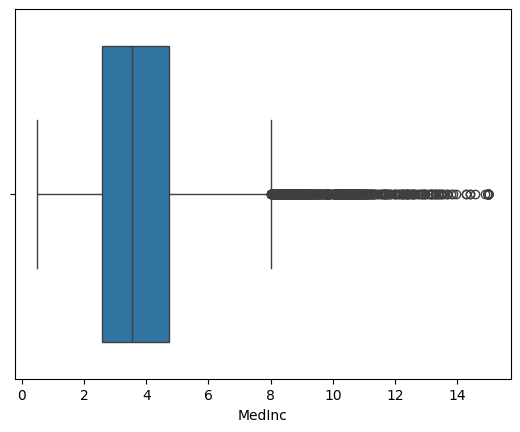

Dari gambar diatas dapat dilihat bahwsannya terdapat banyak outlier pada fitur MedInc

2. Fitur HouseAge
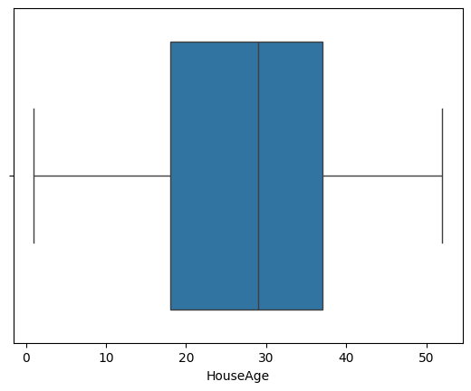

Dari gambar diatas dapat dilihat bahwsannya tidak terdapat outlier pada fitur HouseAge

3. Fitur AveRooms
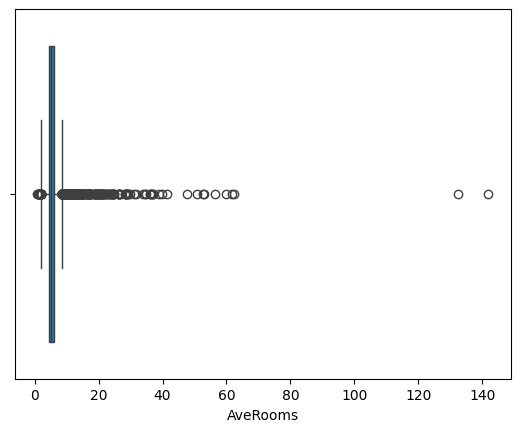

Dari gambar diatas dapat dilihat bahwsannya terdapat banyak outlier pada fitur AveRooms

4. Fitur AveBedrms
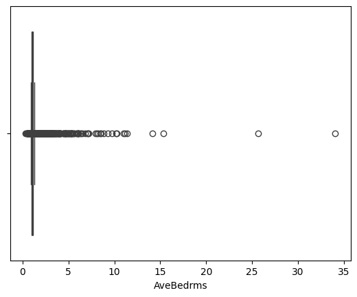

Dari gambar diatas dapat dilihat bahwsannya terdapat banyak outlier pada fitur AveBedrms

5. Fitur Population
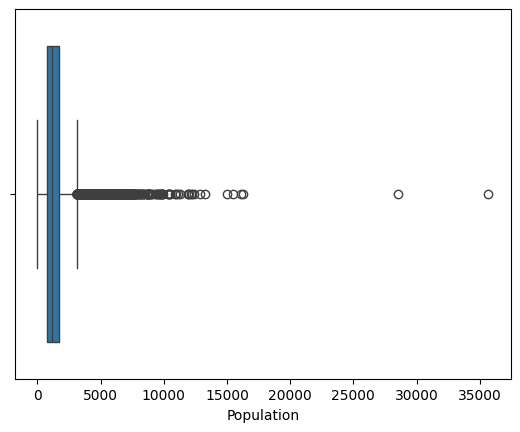

Dari gambar diatas dapat dilihat bahwsannya terdapat banyak outlier pada fitur Population

6. Fitur AveOccup
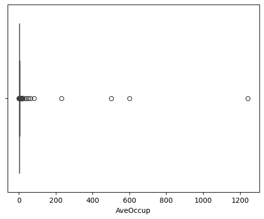

Dari gambar diatas dapat dilihat bahwsannya terdapat banyak outlier pada fitur AveOccup

7. Fitur Latitude
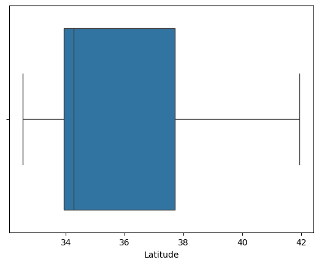

Dari gambar diatas dapat dilihat bahwsannya tidak terdapat outlier pada fitur Latitude

8. Fitur Longitude
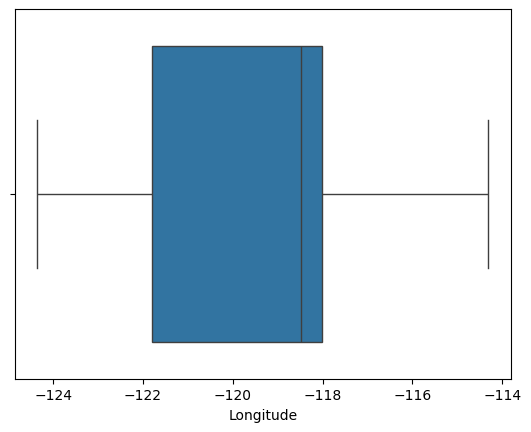

Dari gambar diatas dapat dilihat bahwsannya tidak terdapat outlier pada fitur Longitude

Setelah melihat visualisasi menggunakan boxplot diatas dan juga menampilkan IQR nya. Dapat dilihat bahwa terdapat beberapa fitur yang memiliki outlier seperti MedInc, AveRooms, AveBedrms, Population, AveOccup. Namun ada beberapa fitur yang tidak memiliki tanda-tanda outlier seperti HouseAge, Latitude, dan Longitude.

Oleh karena itu akan diperlakukan pembersihan outlier dengan konsep IQR dimana Seltman (2018) dalam “Experimental Design and Analysis” menyatakan bahwa outliers yang diidentifikasi oleh boxplot (disebut juga “boxplot outliers”) didefinisikan sebagai data yang nilainya 1.5 QR di atas Q3 atau 1.5 QR di bawah Q1. Berikut merupakan gambaran visualisasinya:

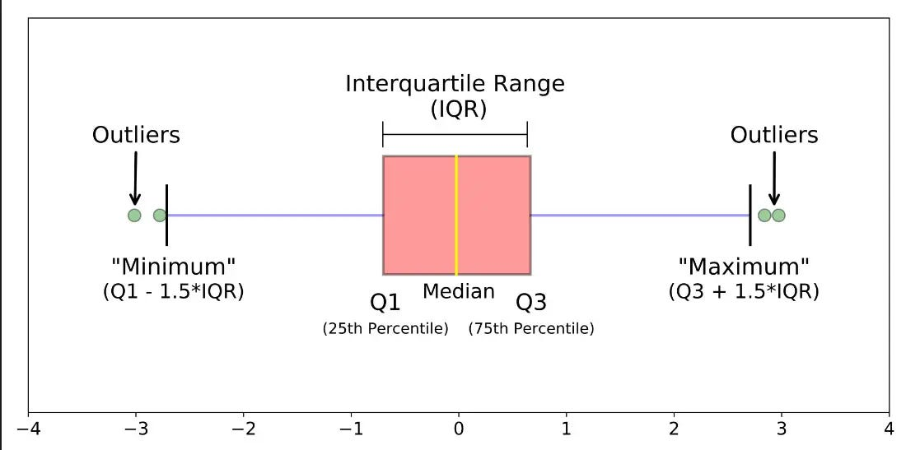
(Iguenfer, 2019)

Setelah dilakukan proses penghapusan outlier dengan teknik IQR, data yang semula memiliki total 20640, sekarang menjadi 16312. Hasil tersebut menunjukkan bahwa terdapat lebih dari 4000 outlier yang terhapus melalui teknik ini.


### Univariate Analysis

Setelah melalui tahapan pengecek deskripsi setiap fitur, ditemukan bahwa tidak adanya data berjenis kategori, oleh karena itu akan difokuskan untuk membahas data bertipe numerik. Pertama, akan dilakukan plot menggunakan histogram untuk melihat persebaran tiap datanya dan divisualisasikan sebagai berikut:
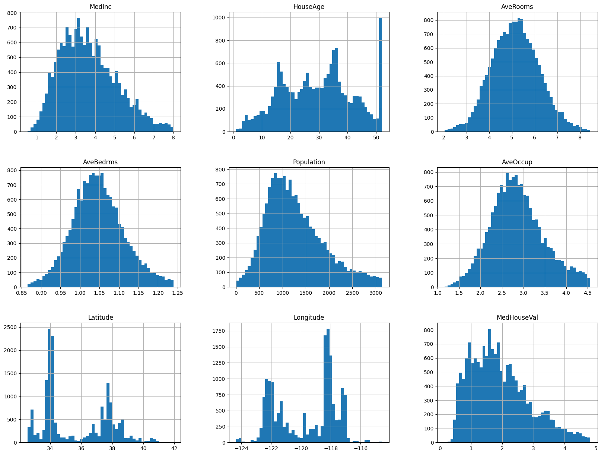

Berdasarkan histogram, AveRooms dan AveBedrms memperlihatkan distribusi yang mendekati normal. Terlihat adanya skewness positif pada distribusi MedInc, Population, dan MedHouseVal, dengan ekor yang memanjang ke kanan. Di sisi lain, HouseAge, Latitude, dan Longitude tidak mengikuti pola distribusi yang jelas dan menunjukkan persebaran data yang tidak beraturan. Karakteristik distribusi yang berbeda ini perlu dipertimbangkan dalam analisis selanjutnya.

### Multivariate Analysis

Kemudian setelah dilakukan pengecekan individu untuk tiap fitur, akan dilakukan pengecekan secara terhubung untuk beberapa fitur dengan Multivariate Analysis. Akan digunakan pair plot untuk memvisualisasikan hubungan antar satu fitur dengan fitur yang lain sebagai berikut:

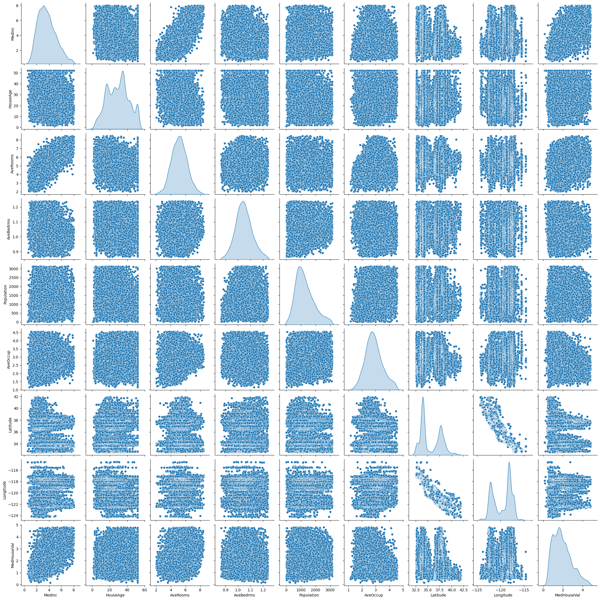

Kemudian akan digunakan heatmap untuk melihat nilai matriks korelasi antar fitur dimana nilainya berada di rentang -1 sampai dengan 1. Untuk lebih detailnya, nilai yang mendekati 1 menunjukkan hubungan yang sangat kuat secara positif dan sebaliknya jika mendekati -1 maka menunjukkan hubungan yang sangat kuat secara negatif. Kemudian jika angkanya mendekati 0, maka antar fitur tidak memiliki hubungan atau hubungannya sangat lemah. Berikut hasil dari korelasi matriksnya:

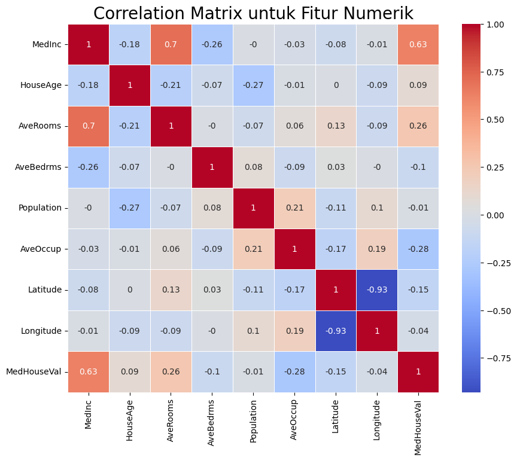

Berdasarkan analisis Matrik Korelasi, dapat disimpulkan bahwa MedInc (Median Income) dengan nilai 0.63 menunjukkan hubungan atau korelasi yang cukup signifikan dengan MedHouseVal (Median House Value) atau harga rumah. Hal ini mengindikasikan bahwa pendapatan median di suatu wilayah memiliki pengaruh yang cukup besar terhadap harga median rumah di wilayah tersebut.

Sebaliknya, fitur-fitur seperti HouseAge (Usia Rumah), AveBedrms (Rata-rata Jumlah Kamar Tidur), Population (Populasi), Latitude (Garis Lintang), dan Longitude (Garis Bujur) memperlihatkan korelasi yang sangat lemah atau bahkan mendekati nol dengan MedHouseVal. Rendahnya korelasi ini menyarankan bahwa fitur-fitur tersebut memiliki kontribusi yang minimal atau tidak signifikan dalam memprediksi variasi harga rumah berdasarkan data yang ada. Oleh karena itu, berdasarkan temuan ini, fitur-fitur dengan korelasi rendah tersebut berpotensi untuk dihilangkan (dropped) dari model untuk menyederhanakan analisis dan mungkin meningkatkan efisiensi model.

Penemuan ini secara langsung menjawab pertanyaan penelitian pertama mengenai tingkat signifikansi fitur properti dalam mempengaruhi harga. Hasil dari Correlation Matrix, yang didukung oleh visualisasi sebelumnya (kemungkinan merujuk pada histogram yang menunjukkan distribusi fitur), mengindikasikan bahwa fitur-fitur yang tersedia dalam dataset ini secara keseluruhan tidak memiliki ikatan yang 'sangat kuat' dalam menentukan harga rumah. Hanya MedInc yang menunjukkan korelasi yang moderat, sementara fitur-fitur lainnya cenderung tidak berkorelasi dengan harga rumah.

Oleh karena itu, fitur-fitur yang akan dipertimbangkan untuk proses selanjutnya adalah sebagai berikut:

1. MedInc
2. AveRooms
3. AveOccup


## Data Preparation

Pada tahap ini, akan dilakukan beberapa persiapan data, yaitu:

1. Reduksi Dimensi dengan PCA jika diperlukan
2. Pembagian dataset dengan fungsi train_test_split dari library sklearn
3. Standarisasi

### Reduksi Dimensi - PCA

Pada tahapan ini, akan dicek dengan menggunakan PCA apakah nantinya reduksi dimensi diperlukan guna lebih mengoptimalkan pemrosesan data. Yaitu dengan cara melihat presentasi data (Rasio Varian) yang terwakilkan oleh komponen-komponen pertama dari PCA. Dengan menggunakan library, akan dicoba untuk reduksi dimensi 3 komponen:

`from sklearn.decomposition import PCA`

Didapatkan rasio varians sebagai berikut
`array([0.77203575, 0.12789963, 0.10006462])`

Analisis PCA menunjukkan bahwa Komponen 1 menyumbang 77% varians, dan dengan Komponen 2 menjadi 90%. Meskipun demikian, reduksi dimensi **tidak dilakukan**. Keputusan ini diambil karena potensi hilangnya informasi penting (10% varians) jika menghilangkan komponen yang terakhir, keinginan untuk mempertahankan interpretasi fitur asli, atau pertimbangan bahwa dataset dan model tidak terlalu terpengaruh oleh dimensi yang ada. Jadi, semua fitur dipertahankan untuk analisis lebih lanjut.

### Train-Test-Split

Karena data cukup banyak, dilakukan train-test split 80:20. 80% untuk training agar model belajar maksimal, dan 20% untuk testing untuk evaluasi performa pada data baru. Rasio ini dianggap ideal untuk dataset yang besar. Dari proses tersebut didapatkan hasil sebagai berikut:

```
Total # of sample in whole dataset: 16312
Total # of sample in train dataset: 13049
Total # of sample in test dataset: 3263
```

### Standariasi

Tahap selanjutnya adalah standarisasi fitur. Proses ini melibatkan transformasi data pada setiap kolom fitur sehingga memiliki nilai rata-rata (mean) sebesar 0 dan standar deviasi sebesar 1. Standarisasi penting dilakukan untuk menyeragamkan skala nilai antar fitur yang berbeda. Hal ini dapat mencegah fitur dengan skala nilai yang lebih besar mendominasi perhitungan dalam algoritma pembelajaran mesin. Akan digunakan library dari sklearn yaitu:

`from sklearn.preprocessing import StandardScaler`

Kemudian dapat dicek dengan menggunakan info statistik `describe()` bahwasannya data sudah berhasil terstandarisasi sebagai berikut:

| Fitur        | MedInc    | AveRooms  | AveOccup  |
|--------------|-----------|-----------|-----------|
| count        | 20640.0   | 20640.0   | 20640.0   |
| mean         | 0.0000    | -0.0000   | -0.0000   |
| std          | 1.0000    | 1.0000    | 1.0000    |
| min          | -2.1595   | -2.9973   | -2.7154   |
| 25%          | -0.7568   | -0.7048   | -0.6841   |
| 50%          | -0.1053   | -0.0151   | -0.0853   |
| 75%          | 0.6377    | 0.6649    | 0.6090    |
| max          | 3.0190    | 3.1810    | 2.7070    |

Data diatas menunjukkan nilai mean=0, dan std=1.

## Modeling

Pada tahapan ini, akan dilakukan eksperimen dengan beberapa algoritma <i><i>Machine Learning</i></i> yang umum digunakan untuk tugas regresi, yaitu: Random Forest, AdaBoost, Multi-layer Perceptron (MLP), dan Support Vector Regression (SVR). Tujuan dari eksplorasi ini adalah untuk mengidentifikasi model yang paling efektif dalam memprediksi harga rumah berdasarkan fitur-fitur yang tersedia.

Untuk setiap algoritma, akan dilakukan hyperparameter tuning menggunakan teknik GridSearchCV yaitu salah satu library dari `sklearn`. Proses ini melibatkan pendefinisian serangkaian nilai parameter yang berbeda (param_grids) untuk setiap model. Secara intuisi, GridSearchCV secara sistematis mencoba semua kombinasi parameter yang mungkin dari grid yang ditentukan, melatih model untuk setiap kombinasi menggunakan data pelatihan, dan mengevaluasi performanya menggunakan validasi silang. Tujuannya adalah untuk menemukan kombinasi parameter yang menghasilkan performa terbaik pada data yang tidak terlihat.

Berikut adalah grid parameter yang dieksplorasi untuk setiap algoritma:

1. **Random Forest**

Parameter:

- n_estimators: Jumlah pohon dalam hutan `(50, 100)`.
- max_depth: Kedalaman maksimum pohon `(None, 10, 20)`. None berarti tidak ada batasan kedalaman.

Kelebihan:

- Robust terhadap overfitting, terutama dengan jumlah pohon yang banyak.
- Dapat menangani fitur dengan skala yang berbeda tanpa perlu penskalaan.
- Memberikan informasi mengenai pentingnya fitur.
- Dapat menangani data non-linear dengan baik.

Kekurangan:

- Mungkin kurang efektif untuk data dengan struktur linear yang kuat.
- Dapat menjadi komputasi mahal dan memakan banyak memori untuk dataset yang sangat besar dan jumlah pohon yang banyak.
- Sulit untuk diinterpretasikan dibandingkan dengan model linear.

2. **AdaBoost**

Parameter:
- n_estimators: Jumlah base estimator (pohon keputusan lemah) yang akan dilatih secara berurutan `(50, 100)`.
- learning_rate: Bobot yang diterapkan pada setiap base estimator `(0.01, 0.1, 1)`. Learning rate yang rendah membutuhkan lebih banyak estimator tetapi dapat menghasilkan model yang lebih robust.

Kelebihan:

- Mudah diimplementasikan.
Dapat meningkatkan akurasi model lemah.
- Kurang rentan terhadap overfitting dibandingkan dengan algoritma boosting lainnya jika parameter diatur dengan tepat.

Kekurangan:

- Sensitif terhadap noise dan outlier dalam data.
- Performa sangat bergantung pada kualitas base estimator.
- Mungkin overfit jika learning rate terlalu tinggi atau jumlah estimator terlalu banyak.

3. **Multi-layer Perceptron (MLP)**

Parameter:

- hidden_layer_sizes: Jumlah neuron pada setiap lapisan tersembunyi `((50,), (100,), (100, 50))`.
- alpha: Parameter regularisasi L2 untuk mencegah overfitting `(0.0001, 0.001)`.
- learning_rate_init: Tingkat pembelajaran awal untuk pengoptimalan bobot `(0.001, 0.01)`.
- max_iter: Jumlah maksimum iterasi (epoch) selama pelatihan `(500, 1000)`.

Kelebihan:

- Mampu mempelajari hubungan non-linear yang kompleks dalam data.
- Fleksibel dalam pemodelan berbagai jenis data.
- Dapat mencapai akurasi yang tinggi untuk masalah yang kompleks.

Kekurangan:

- Cenderung menjadi black box, sulit untuk diinterpretasikan.
- Membutuhkan waktu pelatihan yang lebih lama, terutama untuk arsitektur yang dalam dan dataset yang besar.
- Sensitif terhadap pemilihan hyperparameter dan inisialisasi bobot.
- Rentan terhadap overfitting jika tidak diregularisasi dengan baik.

Tahapan ini membahas mengenai model <i><i>Machine Learning</i></i> yang digunakan untuk menyelesaikan permasalahan. Anda perlu menjelaskan tahapan dan parameter yang digunakan pada proses pemodelan.

4. **Support Vector Regression (SVR)**

Parameter:

- C: Parameter regularisasi. Semakin besar nilai C, semakin besar penalti untuk kesalahan, yang dapat menyebabkan overfitting `(0.1, 1, 10)`.
- kernel: Fungsi kernel yang digunakan untuk memetakan data ke ruang dimensi yang lebih tinggi `('rbf', 'linear')`. Kernel `'rbf'` (radial basis function) cocok untuk data non-linear, sedangkan `'linear'` cocok untuk data linear.

Kelebihan:

- Efektif dalam ruang dimensi tinggi.
- Robust terhadap outlier dengan penggunaan kernel yang tepat.
- Memiliki dasar teoritis yang kuat.

Kekurangan:

- Komputasi mahal untuk dataset yang sangat besar.
- Pemilihan kernel dan hyperparameter yang tepat sangat penting untuk performa model.
- Kurang intuitif dibandingkan dengan model linear.

Setelah dilakukan proses hyperparameter tuning dengan GridSearchCV untuk setiap model, akan dievaluasi performa terbaik yang dicapai oleh masing-masing algoritma pada data pengujian dengan membandingkan nilai dari metrik evaluasi yaitu Mean Squared Error pada Tes Data. Untuk lebih jelasnya mengenai metrik evaluasi akan dijelaskan pada modul selanjutnya.

**Rubrik/Kriteria Tambahan (Opsional)**: 
- Menjelaskan kelebihan dan kekurangan dari setiap algoritma yang digunakan.
- Jika menggunakan satu algoritma pada solution statement, lakukan proses improvement terhadap model dengan hyperparameter tuning. **Jelaskan proses improvement yang dilakukan**.
- Jika menggunakan dua atau lebih algoritma pada solution statement, maka pilih model terbaik sebagai solusi. **Jelaskan mengapa memilih model tersebut sebagai model terbaik**.

## Evaluation

Pada bagian ini, metrik evaluasi yang digunakan untuk mengukur performa model regresi adalah Mean Squared Error (MSE). Selanjutnya, hasil proyek akan dijelaskan berdasarkan metrik evaluasi ini.

### Definisi:

Mean Squared Error (MSE) adalah metrik yang umum digunakan dalam tugas regresi untuk mengukur rata-rata dari kuadrat perbedaan antara nilai prediksi oleh model dan nilai sebenarnya dari data. Secara intuitif, MSE mengukur seberapa dekat garis regresi dengan sekumpulan titik data. Nilai MSE yang lebih rendah menunjukkan bahwa model memiliki kesalahan prediksi yang lebih kecil, dan oleh karena itu, performanya dianggap lebih baik.

### Hasil Evaluasi Model dengan MSE

Setelah dilakukan hyperparameter tuning dengan GridSearchCV, kombinasi parameter terbaik yang menghasilkan performa optimal untuk setiap model adalah sebagai berikut:

1. Random Forest

Parameter terbaik yang ditemukan adalah `{'max_depth': 10, 'n_estimators': 100}`. Ini berarti model Random Forest dengan kedalaman maksimum pohon sebesar 10 dan jumlah pohon sebanyak 100 menghasilkan performa terbaik pada data validasi selama proses tuning.

2. AdaBoost

Parameter terbaik yang ditemukan adalah `{'learning_rate': 0.1, 'n_estimators': 50}`. Ini mengindikasikan bahwa model AdaBoost dengan tingkat pembelajaran sebesar 0.1 dan jumlah base estimator (weak learner) sebanyak 50 memberikan hasil terbaik.

3. MLP

Parameter terbaik yang ditemukan adalah `{'alpha': 0.0001, 'hidden_layer_sizes': (100, 50), 'learning_rate_init': 0.001, 'max_iter': 500}`. Konfigurasi ini menunjukkan bahwa arsitektur jaringan saraf tiruan MLP dengan dua lapisan tersembunyi (100 neuron pada lapisan pertama dan 50 neuron pada lapisan kedua), parameter regularisasi L2 sebesar 0.0001, tingkat pembelajaran awal sebesar 0.001, dan jumlah iterasi maksimum sebesar 500 menghasilkan performa terbaik.

4. SVR 

Parameter terbaik yang ditemukan adalah `{'C': 1, 'kernel': 'rbf'}`. Ini menunjukkan bahwa model Support Vector Regression dengan parameter regularisasi C sebesar 1 dan penggunaan kernel Radial Basis Function ('rbf') memberikan hasil prediksi terbaik.

Kombinasi parameter terbaik ini kemudian digunakan untuk melatih kembali model secara keseluruhan dan dievaluasi performanya pada data pengujian (test set), yang hasilnya telah disajikan sebelumnya. Pemilihan parameter-parameter ini bertujuan untuk memaksimalkan kemampuan generalisasi model terhadap data yang belum pernah dilihat.

Berdasarkan metrik evaluasi Mean Squared Error (MSE), performa dari berbagai model yang telah dilatih dan sebelum di-tune adalah sebagai berikut:

| Model         | Train MSE  | Test MSE  |
|--------------|------------|-----------|
| Random Forest | 0.060423  | 2.311445  |
| AdaBoost      | 0.477667  | 1.857930  |
| MLP          | 0.381007  | 5.860729  |
| SVR          | 0.386813  | 1.143348  |

Kemudian setelah proses hyperparameter tuning, dihasilkan data seperti berikut: 
| Model         | Train MSE  | Test MSE  |
|--------------|------------|-----------|
| Random Forest | 0.257210  | 2.405120  |
| AdaBoost      | 0.447457  | 1.732050  |
| MLP          | 0.383181  | 5.808379  |
| SVR          | 0.386813  | 1.143348  |

Berikut representasi hasil diatas dalam gambar:
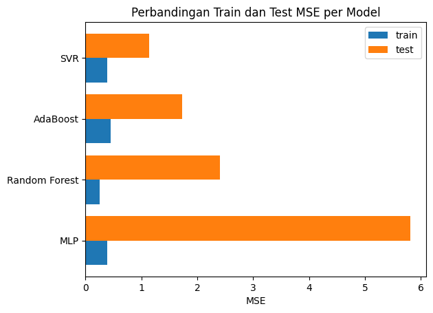

Dari tabel dan gambar di atas, dapat diamati bahwa Support Vector Regression (SVR) menunjukkan nilai Test MSE yang paling rendah, yaitu 1.143348 baik pada hasil sebelum maupun sesudah hyperparamteer tuning. Nilai ini mengindikasikan bahwa secara rata-rata, kuadrat perbedaan antara harga rumah yang diprediksi oleh model SVR dan harga rumah sebenarnya pada data pengujian adalah sebesar 1.143348. Karena MSE mengukur besarnya kesalahan prediksi, nilai yang lebih rendah menunjukkan performa model yang lebih baik dalam melakukan prediksi pada data yang belum pernah dilihat.

Sebaliknya, model MLP memiliki nilai Test MSE yang paling tinggi (5.808379), yang menunjukkan bahwa model ini memiliki kesalahan prediksi yang paling besar di antara model-model yang dievaluasi. Sementara itu, model Random Forest dan AdaBoost menunjukkan nilai Test MSE di antara keduanya, dengan AdaBoost memberikan performa yang lebih baik daripada Random Forest pada data pengujian berdasarkan metrik MSE.

Secara keseluruhan, berdasarkan metrik Mean Squared Error (MSE), SVR terpilih sebagai model terbaik karena kemampuannya dalam menghasilkan prediksi harga rumah yang paling akurat pada data pengujian, yang ditunjukkan oleh nilai MSE yang paling rendah.

Kemudian, berikut ini adalah contoh hasil prediksi menggunakan model-model terbaik setelah proses tuning:

| y_true | prediksiRF | prediksiBoosting | prediksiMLP | prediksiSVR |
|--------|------------|-----------------|-------------|-------------|
| 1.724  | 3.366099   | 2.865025        | 4.757078    | 2.009672    |

Pada contoh ini, SVR memberikan prediksi yang paling mendekati nilai sebenarnya.

### Kesimpulan

Berdasarkan problem statement diawal yaitu mengenai analisis korelasi dan visualisasi distribusi data, MedInc teridentifikasi memiliki hubungan yang cukup signifikan dengan MedHouseVal. Sementara fitur lain seperti HouseAge, AveBedrms, Population, Latitude, dan Longitude menunjukkan korelasi yang lemah terhadap harga rumah. Hal ini menunjukkan bahwa hanya sedikit saja dari fitur/kolom yang memiliki hubungan kuat dengan harga rumah.

Lebih lanjut, evaluasi model regresi setelah hyperparameter tuning menunjukkan bahwa Support Vector Regression (SVR) memberikan performa prediksi terbaik pada data pengujian dengan nilai Test MSE terendah (1.143348). Meskipun AdaBoost menunjukkan peningkatan setelah tuning, performanya masih di bawah SVR. Sementara itu, model Random Forest dan MLP menunjukkan performa yang kurang memuaskan.

Dengan demikian, SVR menjadi model terbaik dalam memprediksi harga rumah berdasarkan fitur-fitur yang tersedia. Temuan ini mengimplikasikan bahwa meskipun beberapa fitur memiliki korelasi lemah dengan harga, SVR mampu memanfaatkan pola yang ada dalam data untuk menghasilkan prediksi yang paling akurat. Lebih lanjut, signifikansi MedInc dalam korelasi juga tercermin dalam performa model secara keseluruhan.

<br>


# Referensi
1. East Asia Forum. (2024, June 26). Indonesia still searching for an answer to its housing crisis. East Asia Forum. Diperoleh dari https://eastasiaforum.org/2024/06/26/indonesia-still-searching-for-an-answer-to-its-housing-crisis/
2. Iguenfer, F. Z. (2019). IQR rule for outliers detection. Medium. Diakses dari https://medium.com/@fz.iguenfer/iqr-rule-for-outliers-detection-6e9fcbcf2099
3. OECD. (2024). Society at a Glance 2024: OECD Social Indicators. OECD Publishing. https://doi.org/10.1787/918d8db3-en
4. Seltman, H. J. (2018). Experimental design and analysis. Tersedia di [tautan]. Diakses pada Mei 2024.


