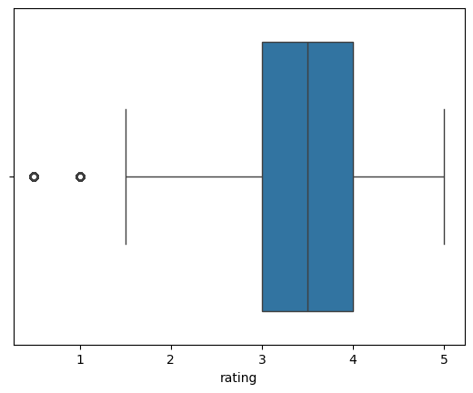
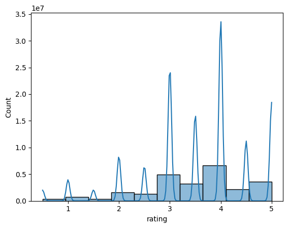
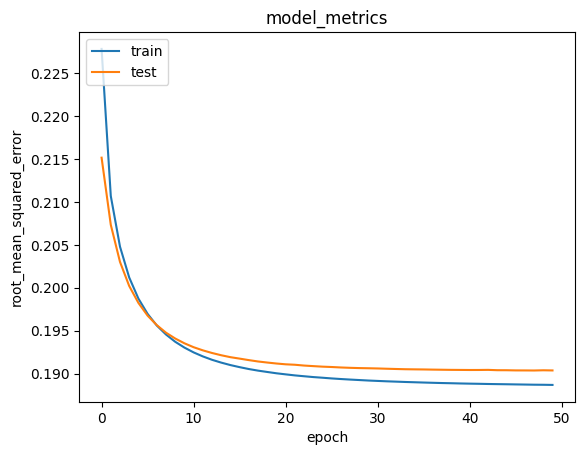

<script type="text/javascript" async
  src="https://cdn.jsdelivr.net/npm/mathjax@3/es5/tex-mml-chtml.js">
</script>

## Project Overview

Sistem rekomendasi telah menjadi bagian tak terpisahkan dari pengalaman digital kita sehari-hari, mulai dari platform *e-commerce* hingga layanan streaming musik dan video. Di era informasi berlebih seperti sekarang, pengguna sering kali kewalahan dengan banyaknya pilihan yang tersedia. Dalam konteks industri hiburan, khususnya film, tantangan ini semakin terasa. Dengan ribuan film yang dirilis setiap tahun, menemukan konten yang relevan dan menarik bagi preferensi individu menjadi tugas yang memakan waktu dan seringkali frustrasi. Inilah mengapa sistem rekomendasi film menjadi krusial.

Masalah utama yang ingin diselesaikan oleh proyek ini adalah memudahkan pengguna dalam menemukan film yang sesuai dengan selera mereka, sekaligus meningkatkan kepuasan pengguna dan retensi pada platform penyedia konten. Tanpa sistem rekomendasi yang efektif, pengguna mungkin melewatkan film-film berkualitas yang seharusnya mereka nikmati, atau bahkan meninggalkan platform karena kesulitan menavigasi katalog yang luas. Dengan menyediakan rekomendasi yang personal dan akurat, platform dapat meningkatkan keterlibatan pengguna, memperpanjang durasi tontonan, dan secara tidak langsung mendorong pertumbuhan pendapatan.

Penyelesaian masalah ini akan dilakukan melalui pengembangan sistem rekomendasi film berbasis filtrasi konten (content-based filtering) dan kolaboratif (collaborative filtering). 

Filtrasi Kolaboratif dipilih karena kemampuannya untuk mengidentifikasi pola preferensi tersembunyi berdasarkan perilaku pengguna lain yang memiliki selera serupa. Riset menunjukkan bahwa filtrasi kolaboratif telah berhasil diterapkan secara luas dalam berbagai sistem rekomendasi, termasuk yang digunakan oleh raksasa teknologi seperti Netflix dan Amazon, dengan hasil yang menjanjikan dalam hal akurasi dan kepuasan pengguna (Su & Khoshgoftaar, 2009). Pendekatan ini sangat efektif ketika data interaksi pengguna melimpah, dan berfokus pada kesamaan perilaku antara pengguna atau kesamaan item berdasarkan evaluasi pengguna.

Di sisi lain, Filtrasi Berbasis Konten menawarkan pendekatan yang berbeda dengan merekomendasikan item yang serupa dengan item yang disukai pengguna di masa lalu. Ini bekerja dengan menganalisis atribut-atribut dari item itu sendiri (misalnya, genre film, aktor, sutradara, kata kunci deskriptif). Contohnya, jika seorang pengguna sering menonton film action dengan Dwayne Johnson, sistem berbasis konten akan merekomendasikan film action lain yang juga dibintangi Dwayne Johnson atau memiliki genre serupa. Kelebihan dari pendekatan ini adalah kemampuannya untuk merekomendasikan item baru yang belum pernah dinilai oleh banyak pengguna (new item problem atau cold start for items), serta memberikan rekomendasi yang transparan karena dapat menjelaskan mengapa suatu item direkomendasikan berdasarkan fitur-fiturnya (Lops et al., 2011). Namun, tantangannya adalah kesulitan dalam merekomendasikan item di luar "zona nyaman" preferensi pengguna, karena hanya mengandalkan histori interaksi dengan fitur-fitur yang sudah diketahui.

Dengan mempertimbangkan kedua pendekatan ini, proyek akan mengeksplorasi bagaimana kombinasi atau implementasi salah satu di antaranya dapat memberikan rekomendasi film yang paling efektif. Dataset film yang digunakan akan memungkinkan analisis baik dari sisi interaksi pengguna maupun fitur-fitur film untuk membangun sistem rekomendasi yang komprehensif.

## Business Understanding

### Problem Statements

Bagian ini menguraikan pertanyaan-pertanyaan kunci yang akan dijawab oleh proyek ini. Dengan berfokus pada implementasi content-based filtering dan collaborative filtering, pernyataan masalah ini akan memandu eksplorasi dan pengembangan sistem rekomendasi film.

1. Bagaimana sistem rekomendasi film berbasis content-based filtering dapat diimplementasikan untuk secara efektif merekomendasikan film kepada pengguna berdasarkan preferensi mereka terhadap atribut film (genre)?

2. Bagaimana sistem rekomendasi film berbasis collaborative filtering dapat diimplementasikan untuk secara akurat memprediksi preferensi pengguna dan merekomendasikan film berdasarkan pola perilaku pengguna lain yang serupa?

### Goals

Bagian ini menguraikan tujuan spesifik yang ingin dicapai oleh proyek ini, yang secara langsung menjawab setiap pernyataan masalah yang telah dirumuskan.

1. **Tercapainya sistem rekomendasi film berbasis content-based filtering yang mampu merekomendasikan film secara efektif kepada pengguna berdasarkan preferensi mereka terhadap atribut film (genre)**.

    Tujuan ini berfokus pada pembangunan kapabilitas sistem untuk menganalisis dan memahami konten film, khususnya genre, guna menghasilkan rekomendasi yang relevan secara personal.

2. **Tercapainya sistem rekomendasi film berbasis collaborative filtering yang dapat memprediksi preferensi pengguna secara akurat dan merekomendasikan film berdasarkan pola perilaku pengguna lain yang serupa**.

    Tujuan ini berfokus pada pengembangan kemampuan sistem untuk belajar dari interaksi pengguna (rating) dan menemukan pola tersembunyi untuk memprediksi minat pengguna terhadap film yang belum mereka tonton.

#### Solution Approach

Untuk mencapai tujuan yang telah ditetapkan, proyek ini mengimplementasikan dua pendekatan utama dalam sistem rekomendasi film: Filtrasi Berbasis Konten (Content-Based Filtering) dan Filtrasi Kolaboratif (Collaborative Filtering).

1. **Pendekatan Filtrasi Berbasis Konten (Content-Based Filtering) dengan TF-IDF Vectorizer dan Cosine Similarity**:

  Berikut uraian langkah-langkah pada tahap ini:

  - Ekstraksi Fitur: Film direpresentasikan berdasarkan atribut genre mereka. Kolom genres dari dataset movie dibersihkan dengan menghapus spasi dan mengubahnya menjadi huruf kecil.
  - Vektorisasi Teks: Untuk mengubah genre teks menjadi representasi numerik yang dapat diproses oleh model, TF-IDF Vectorizer dari sklearn.`feature_extraction.text` digunakan. Ini akan menghasilkan matriks TF-IDF di mana setiap baris mewakili film dan setiap kolom mewakili genre, dengan nilai yang menunjukkan pentingnya genre tersebut untuk film (TF-IDF matrix memiliki dimensi 62423 film dan 24 genre unik).

  - Perhitungan Kesamaan: Cosine Similarity dihitung antara semua film menggunakan matriks TF-IDF yang telah dibuat. Hasilnya adalah matriks kesamaan (cosine similarity matrix) yang menunjukkan tingkat kemiripan antara setiap pasang film berdasarkan genre mereka. Matriks kesamaan ini kemudian disimpan dalam DataFrame cosine_sim_df.


  - Mekanisme Rekomendasi: Fungsi `movie_recommendations` dibuat untuk merekomendasikan film. Fungsi ini mengambil judul film, matriks kesamaan, dan jumlah rekomendasi (`k`) sebagai input. Rekomendasi diberikan dengan menemukan film-film yang memiliki nilai cosine similarity tertinggi dengan film input.

  - Evaluasi: Evaluasi dilakukan dengan membandingkan genre movie yang direkomendasikan dengan movie yang digunakan sebagai pencarian, semakin banyak model memberikan genre yang sejenis, maka sistem rekomendasi telah dikatakan berhasil.

2. **Pendekatan Filtrasi Kolaboratif (Collaborative Filtering) Berbasis Model dengan Neural Network (RecommenderNet)**:

  Berikut uraian langkah-langkah pada tahap ini:

  - Persiapan Data: Dataset rating digunakan, dengan kolom timestamp dihilangkan karena tidak relevan untuk model ini. Kolom userId dan movieId di-encode menjadi representasi numerik user dan movie yang unik dan berurutan untuk digunakan dalam model neural network. Rentang rating (0.5 hingga 5.0) juga diidentifikasi.


  - Normalisasi Rating: Nilai rating dinormalisasi ke rentang 0 hingga 1 menggunakan rumus `(x−min_rating)/(max_rating−min_rating)` untuk kestabilan pelatihan model.
  - Arsitektur Model: Model `RecommenderNet` dikembangkan menggunakan `TensorFlow Keras`. Model ini mengimplementasikan lapisan embedding untuk user dan movie yang belajar representasi laten dari masing-masing entitas. Embedding pengguna dan film digabungkan melalui perkalian titik (dot product), dan ditambahkan bias pengguna serta bias film. Fungsi aktivasi sigmoid diterapkan pada output untuk menghasilkan prediksi rating antara 0 dan 1. Regularisasi L2 diterapkan pada embedding untuk mencegah overfitting.

  - Pelatihan Model: Model dikompilasi dengan `BinaryCrossentropy` sebagai fungsi `loss`, `Adam` optimizer dengan learning rate 0.0001, dan Root Mean Squared Error (RMSE) sebagai metrik evaluasi. Model dilatih selama 50 epochs dengan ukuran batch 2048. 

  - Evaluasi Model: Metrik pelatihan dan validasi (RMSE) dipantau selama pelatihan untuk menilai kinerja model dan mendeteksi overfitting atau underfitting.
  - Mekanisme Rekomendasi: Setelah pelatihan, model digunakan untuk memprediksi rating pengguna untuk film-film yang belum mereka tonton. Film dengan prediksi rating tertinggi kemudian direkomendasikan.

  Dengan mengimplementasikan kedua pendekatan ini secara terpisah, proyek ini dapat menganalisis dan membandingkan efektivitas masing-masing metode dalam menghasilkan rekomendasi film yang relevan dan akurat.

## Data Understanding

### Deskripsi Dataset
Proyek ini menggunakan dataset film dan rating yang tersedia di Kaggle dan dapat diakses melalui tautan berikut: [Movie Dataset](https://www.kaggle.com/datasets/parasharmanas/movie-recommendation-system/data). Dataset ini terdiri dari dua berkas CSV utama: `movies.csv` dan `ratings.csv`. Berkas `movies.csv` berisi informasi tentang film, sedangkan `ratings.csv` berisi data rating yang diberikan pengguna kepada film.

Dataset `movies.csv` memiliki jumlah data film sebanyak 62.423 entri unik. Sementara itu, dataset `ratings.csv` mencakup total 25.000.095 entri rating yang diberikan oleh 162.541 pengguna unik. Kondisi data menunjukkan bahwa terdapat kolom `timestamp` pada dataset `ratings.csv` yang kemudian dihilangkan karena tidak relevan untuk tujuan sistem rekomendasi ini. Rentang nilai `rating` pada dataset adalah dari 0.5 hingga 5.0.

Variabel-variabel pada dataset yang digunakan adalah sebagai berikut:

1. Dataset `movies.csv`:

  - `movieId`: Merupakan ID unik untuk setiap film.
  - `title`: Merupakan judul film, yang juga menyertakan tahun rilis film tersebut.
  - `genres`: Merupakan kategori genre dari film, yang dapat berupa beberapa genre yang dipisahkan oleh karakter pip '`|`'. Contoh: "`Adventure|Animation|Children|Comedy|Fantasy`". Dalam pra-pemrosesan, nilai ini diubah menjadi huruf kecil dan spasi dihilangkan (misalnya "`adventure animation children comedy fantasy`").

2. Dataset `ratings.csv`:

  - `userId`: Merupakan ID unik untuk setiap pengguna yang memberikan rating.
  - `movieId`: Merupakan ID film yang di-rating oleh pengguna.
  - `rating`: Merupakan nilai rating yang diberikan pengguna kepada film, dalam skala 0.5 hingga 5.0. Distribusi rating menunjukkan bahwa rating 4.0 adalah yang paling sering diberikan, diikuti oleh 3.0 dan 5.0.
  - `timestamp`: Merupakan waktu saat rating diberikan (dalam format Unix timestamp). Kolom ini dihilangkan dari analisis karena memang tidak dibutuhkan dalam proses pembentukan sistem rekomendasi pada proyek ini.

### Analisis Eksplorasi Data

#### Info dataset dan Cek missing Value

Selain deskripsi variabel diatas, akan digunakan built-in function dari pandas yaitu `info()` untuk mengecek apakah ada missing value pada setiap kolom dan juga tipe dari setiap kolom/fitur dan didapatkan hasil sebagai berikut:

1. Dataset `movies.csv`:

  ```
  <class 'pandas.core.frame.DataFrame'>
  RangeIndex: 62423 entries, 0 to 62422
  Data columns (total 3 columns):
  #   Column   Non-Null Count  Dtype 
  ---  ------   --------------  ----- 
  0   movieId  62423 non-null  int64 
  1   title    62423 non-null  object
  2   genres   62423 non-null  object
  dtypes: int64(1), object(2)
  memory usage: 1.4+ MB
  ```

2. Dataset `ratings.csv`

  ```
  <class 'pandas.core.frame.DataFrame'>
  RangeIndex: 25000095 entries, 0 to 25000094
  Data columns (total 4 columns):
  #   Column     Dtype  
  ---  ------     -----  
  0   userId     int64  
  1   movieId    int64  
  2   rating     float64
  3   timestamp  int64  
  dtypes: float64(1), int64(3)
  memory usage: 762.9 MB
  ```

Dapat dilihat bahwasannya pada tiap dataset, semua fitur/kolom memiliki jenis tipe data numerik dan objek dimana tidak terdapat missing value.

Selain menggunakan fungsi `info()`, akan dicek data statistik berupa mean, min, max, Q1, Q3 dan lain-lain untuk memastikan tidak ada missing value yang tersembunyi seperti misalnya nilai-nilai non-negatif atau nila tak wajar, dan didapatkan hasil sebagai berikut:

1. Dataset `movies.csv`
  <div>
  <style scoped>
      .dataframe tbody tr th:only-of-type {
          vertical-align: middle;
      }

      .dataframe tbody tr th {
          vertical-align: top;
      }

      .dataframe thead th {
          text-align: right;
      }
  </style>
  <table border="1" class="dataframe">
    <thead>
      <tr style="text-align: right;">
        <th></th>
        <th>userId</th>
        <th>movieId</th>
        <th>rating</th>
        <th>timestamp</th>
      </tr>
    </thead>
    <tbody>
      <tr>
        <th>count</th>
        <td>2.500010e+07</td>
        <td>2.500010e+07</td>
        <td>2.500010e+07</td>
        <td>2.500010e+07</td>
      </tr>
      <tr>
        <th>mean</th>
        <td>8.118928e+04</td>
        <td>2.138798e+04</td>
        <td>3.533854e+00</td>
        <td>1.215601e+09</td>
      </tr>
      <tr>
        <th>std</th>
        <td>4.679172e+04</td>
        <td>3.919886e+04</td>
        <td>1.060744e+00</td>
        <td>2.268758e+08</td>
      </tr>
      <tr>
        <th>min</th>
        <td>1.000000e+00</td>
        <td>1.000000e+00</td>
        <td>5.000000e-01</td>
        <td>7.896520e+08</td>
      </tr>
      <tr>
        <th>25%</th>
        <td>4.051000e+04</td>
        <td>1.196000e+03</td>
        <td>3.000000e+00</td>
        <td>1.011747e+09</td>
      </tr>
      <tr>
        <th>50%</th>
        <td>8.091400e+04</td>
        <td>2.947000e+03</td>
        <td>3.500000e+00</td>
        <td>1.198868e+09</td>
      </tr>
      <tr>
        <th>75%</th>
        <td>1.215570e+05</td>
        <td>8.623000e+03</td>
        <td>4.000000e+00</td>
        <td>1.447205e+09</td>
      </tr>
      <tr>
        <th>max</th>
        <td>1.625410e+05</td>
        <td>2.091710e+05</td>
        <td>5.000000e+00</td>
        <td>1.574328e+09</td>
      </tr>
    </tbody>
  </table>
  </div>

2. Dataset `ratings.csv`:
  <div>
  <style scoped>
      .dataframe tbody tr th:only-of-type {
          vertical-align: middle;
      }

      .dataframe tbody tr th {
          vertical-align: top;
      }

      .dataframe thead th {
          text-align: right;
      }
  </style>
  <table border="1" class="dataframe">
    <thead>
      <tr style="text-align: right;">
        <th></th>
        <th>movieId</th>
      </tr>
    </thead>
    <tbody>
      <tr>
        <th>count</th>
        <td>62423.000000</td>
      </tr>
      <tr>
        <th>mean</th>
        <td>122220.387646</td>
      </tr>
      <tr>
        <th>std</th>
        <td>63264.744844</td>
      </tr>
      <tr>
        <th>min</th>
        <td>1.000000</td>
      </tr>
      <tr>
        <th>25%</th>
        <td>82146.500000</td>
      </tr>
      <tr>
        <th>50%</th>
        <td>138022.000000</td>
      </tr>
      <tr>
        <th>75%</th>
        <td>173222.000000</td>
      </tr>
      <tr>
        <th>max</th>
        <td>209171.000000</td>
      </tr>
    </tbody>
  </table>
  </div>

Berdasarkan kedua tabel diatas, dapat dilihat bahwasannya hasilnya bagus tidak ada nilai missing yang tersembunyi seperti yang dikhawatirkan.

#### Mengecek Outlier

Untuk mengecek outlier, akan digunakan teknik IQR dan visualisasi menggunakan `boxplot`. Dengan melihat daftar kolom yang tersedia, yang bisa diobservasi adalah data rating, karena data numerik yang lain adalah data ID, jadi tidak perlu khawatir akan ada outlier. Berikut adalah hasil visualisasi dari `boxplot` untuk kolom rating pada dataset `ratings.csv`



Jika kita melihat pada visualisasi, terdapat 2 titik yang dapat diamati berada kurang dari Q1, namun jika dilihat dari permasalahan yang ingin kita selesaikan yaitu sistem rekomendasi, dimana pengguna bisa saja memang memberikan rating yang rendah, maka hal ini dianggap wajar dan pada proyek ini tidak akan dianggap sebagai sebuah outlier.

#### Univariate Analysis

Masih mengikuti cara pada pembahasan sebelumnya, diketahui bahwa data yang bisa diobservasi adalah data rating, kali ini akan dilakukan plot histogram untuk mengetahui distribusi dari rating 0-5:



Dari gambar diatas dapat diobservasi bahwasannya data memiliki konsentrasi pada rating 4, menunjukkan histogram yang <i>left-skewed</i>

## Data Preparation

Tahap Data Preparation sangat krusial dalam proyek machine learning ini karena data mentah seringkali tidak siap untuk digunakan langsung dalam proses pemodelan. Tujuan utama dari tahap ini adalah untuk membersihkan, mengubah, dan menyusun data agar sesuai dengan format yang dibutuhkan oleh algoritma sistem rekomendasi, baik itu content-based filtering maupun collaborative filtering.

Berikut adalah proses data preparation yang dilakukan secara berurutan:

1. **Mengimpor Library dan Memuat Dataset:**

  - Proses: Pertama, library `pandas` diimpor untuk manipulasi data. Kemudian, dataset `movies.csv` dan `ratings.csv` dimuat ke dalam DataFrame movie dan rating secara berturut-turut.
  - Alasan: Ini adalah langkah awal yang esensial untuk memungkinkan akses dan pengelolaan data dalam lingkungan Python.

2. **Pra-pemrosesan Kolom `genres` (untuk Content-Based Filtering):**

  - Proses: Kolom `genres` pada `DataFrame` `movie` diubah dengan menghapus karakter spasi `(' ')` dan mengubah semua teks menjadi huruf kecil `(.str.lower())`.
  - Alasan: Standardisasi format `genre` ini penting untuk memastikan konsistensi. Menghilangkan spasi dan mengubah ke huruf kecil menghindari duplikasi `genre` yang sebenarnya sama (misalnya, "Action" dan "action") dan memastikan bahwa TF-IDF Vectorizer dapat memprosesnya dengan benar sebagai entitas tunggal, sehingga perhitungan kesamaan menjadi lebih akurat.

3. **Menghilangkan Kolom `timestamp` (untuk Collaborative Filtering):**

  - Proses: Kolom `timestamp` pada DataFrame rating dihilangkan (dropped) karena tidak relevan untuk perhitungan rating atau rekomendasi dalam konteks model collaborative filtering yang akan dibangun.
  - Alasan: Kolom `timestamp` tidak memberikan informasi langsung tentang preferensi pengguna terhadap film yang diperlukan untuk model collaborative filtering berbasis rating. Menghilangkannya mengurangi kompleksitas data dan kebutuhan memori.

4. **Encoding `userId` dan `movieId` (untuk Collaborative Filtering):**

  - Proses:
  Daftar `ID` pengguna unik (`user_ids`) dan `ID` film unik (`movie_ids`) dibuat dari `DataFrame` `rating_clean`. Kemudian dua mapping (kamus) dibuat: `user_to_user_encoded` (memetakan `userId` asli ke indeks numerik berurutan) dan `user_encoded_to_user` (memetakan kembali indeks numerik ke `userId` asli). Proses serupa dilakukan untuk `movieId` (`movie_to_movie_encoded` dan `movie_encoded_to_movie`). Kolom baru user dan movie ditambahkan ke `rating_clean` yang berisi `ID` yang sudah di-encode.
  - Alasan: Model neural network memerlukan input numerik yang berurutan. Proses encoding ini mengubah `ID` pengguna dan film yang mungkin tidak berurutan atau terlalu besar menjadi indeks integer yang lebih kecil dan berurutan, yang efisien untuk digunakan sebagai input embedding layer dalam model neural network. Ini juga membantu dalam mengelola jumlah unique user dan movie secara terstruktur.

5. **Normalisasi Rating (untuk Collaborative Filtering):**

  - Proses: Kolom rating di `DataFrame` `rating_clean` diubah tipe datanya menjadi `float32`. Kemudian, nilai rating dinormalisasi ke rentang antara 0 dan 1 menggunakan rumus: `(x−min_rating)/(max_rating−min_rating)`. Nilai `min_rating` adalah 0.5 dan `max_rating` adalah 5.0.

  - Alasan: Normalisasi rating ke skala 0-1 adalah praktik umum dalam model neural network, terutama ketika menggunakan fungsi aktivasi sigmoid pada output layer yang menghasilkan nilai antara 0 dan 1. Ini membantu model belajar lebih stabil dan efisien, serta memastikan bahwa loss function (seperti Binary Crossentropy yang digunakan) bekerja dengan baik pada skala output yang sesuai.

6. **Pembagian Data Latih dan Validasi (untuk Collaborative Filtering):**

  - Proses: Data `rating_clean` diacak (shuffled) secara acak dengan `random_state=42` untuk memastikan distribusi data yang merata. Kemudian, data dibagi menjadi set pelatihan (80%) dan set validasi (20%). Variabel `x` berisi pasangan (`user, movie`), dan `y` berisi rating yang dinormalisasi.

  - Alasan: Pembagian data menjadi set pelatihan dan validasi sangat penting untuk mengevaluasi performa model secara objektif. Data pelatihan digunakan untuk mengajarkan model, sementara data validasi digunakan untuk menguji seberapa baik model dapat menggeneralisasi pada data yang belum pernah dilihat sebelumnya, membantu mendeteksi overfitting. Pengacakan data memastikan bahwa pembagian tersebut representatif.

## Modeling and Result

Tahap modeling adalah inti dari proyek sistem rekomendasi ini, di mana dua pendekatan utama — Content-Based Filtering dan Collaborative Filtering — diimplementasikan untuk menghasilkan rekomendasi film.

### 1. Sistem Rekomendasi Berbasis Konten (Content-Based Filtering)

**Algoritma/Pendekatan**:
Pendekatan ini menggunakan `TF-IDF Vectorizer` dan `Cosine Similarity` untuk merekomendasikan film berdasarkan kemiripan atribut `genre`.

**Pembentukan Representasi Film**: Fitur genres dari setiap film diolah menggunakan `TfidfVectorizer()` untuk menghasilkan representasi numerik. Matriks TF-IDF yang dihasilkan memiliki dimensi 62423 film dengan 24 genre unik. Setiap baris dalam matriks ini mewakili sebuah film, dan nilai di setiap kolom menunjukkan relevansi genre tertentu bagi film tersebut.

**Perhitungan Kesamaan**: Setelah representasi TF-IDF terbentuk, `cosine_similarity` dihitung antara semua film. Ini menghasilkan matriks kesamaan (cosine similarity matrix) dengan dimensi 62423x62423, di mana setiap sel menunjukkan tingkat kemiripan genre antara dua film.

**Mekanisme Rekomendasi (Top-N Recommendation)**: Fungsi `movie_recommendations` dibuat untuk memberikan rekomendasi. Fungsi ini mengambil judul film (`title`), matriks kesamaan (`similarity_data`), `DataFrame` item (`items`), dan jumlah rekomendasi yang diinginkan (`k`, default 10) sebagai parameter. Fungsi ini mencari film dengan kesamaan terbesar pada indeks matriks kesamaan. Hasilnya adalah Top-N rekomendasi film yang memiliki genre paling mirip dengan film yang dipilih.


**Output (Top-10 Recommendation)**:
Jika film 'Yolanda and the Thief (1945)' (genre: 'fantasy musical romance') dipilih, sistem merekomendasikan film-film sebagai berikut:

| No. | Title | Genres |
| :-- | :---------------------------------- | :--------------------------- |
| 0 | Xanadu (1980) | fantasy musical romance |
| 1 | Brigadoon (1954) | fantasy musical romance |
| 2 | Paheli (2005) | drama fantasy musical romance |
| 3 | Red Shoes, The (1948) | drama fantasy musical romance |
| 4 | Cenerentola '80 (1984) | drama fantasy musical romance |
| 5 | Across the Universe (2007) | drama fantasy musical romance |
| 6 | That Lady in Ermine (1948) | comedy fantasy musical romance |
| 7 | Magic Flute, The (Trollflöjten) (1975) | comedy fantasy musical romance |
| 8 | Princess Raccoon (Operetta tanuki goten) (2005) | comedy fantasy musical romance |
| 9 | Aladin (2009) | comedy fantasy musical romance |

Dapat dilihat berdasarkan output diatas bahwasannya hasil dari rekomendasi menunjukkan kesesuaian genre seperti fantasy, musical, dan romance yang ditunjukkan oleh hasil Top-10 data diatas. 

**Kelebihan**:

- Mampu menangani cold start untuk item baru: Sistem dapat merekomendasikan film baru selama metadata genre-nya tersedia, bahkan jika film tersebut belum memiliki rating dari pengguna.
- Transparansi Rekomendasi: Alasan di balik rekomendasi mudah dijelaskan (misalnya, "Anda menyukai film ini karena bergenre X, dan film rekomendasi juga bergenre X").
- Tidak memerlukan data interaksi pengguna yang banyak: Cukup data fitur item.

**Kekurangan**:

- Kurangnya Keragaman (Serendipity): Cenderung merekomendasikan item yang sangat mirip dengan yang sudah disukai pengguna, sehingga mungkin tidak memperkenalkan pengguna pada genre atau film yang berbeda dari kebiasaan mereka.
- Ketergantungan pada Metadata: Kualitas rekomendasi sangat bergantung pada kekayaan dan akurasi metadata film. Jika metadata tidak lengkap atau salah, rekomendasi bisa menjadi kurang relevan.

### 2. Sistem Rekomendasi Kolaboratif Berbasis Model (Collaborative Filtering)

**Algoritma/Pendekatan**:
Pendekatan ini menggunakan arsitektur Neural Network (`RecommenderNet`) berbasis embedding untuk memprediksi rating film dan merekomendasikannya.

**Persiapan Data Input**: Data rating diproses dengan meng-encode userId dan movieId menjadi indeks numerik berurutan (user dan movie). Rating asli dinormalisasi ke rentang 0-1 untuk kestabilan pelatihan model. Data kemudian dibagi menjadi set pelatihan (80%) dan set validasi (20%).

**Arsitektur Model (`RecommenderNet`)**: Model dibangun menggunakan `TensorFlow Keras`.
- User dan Movie Embedding: Model memiliki lapisan embedding untuk `num_users` dan num_movie, masing-masing dengan ukuran `embedding_size` 10. Embedding ini diinisialisasi dengan '`he_normal`' dan diregularisasi dengan `L2`.
- User dan Movie Bias: Terdapat juga lapisan bias terpisah untuk pengguna dan film.
- Logika Prediksi: Fungsi call model menghitung perkalian titik (dot product) antara vektor embedding pengguna dan film, lalu menambahkan bias pengguna dan film. Hasilnya dilewatkan melalui fungsi aktivasi sigmoid untuk menghasilkan prediksi rating antara 0 dan 1.

**Pelatihan Model**: Model dikompilasi dengan `BinaryCrossentropy` sebagai loss function, `Adam` optimizer dengan `*learning_rate=0.0001`, dan `RootMeanSquaredError` sebagai metrik evaluasi
. Model dilatih selama 50 *epochs* dengan `batch_size=2048`. Proses pelatihan menunjukkan penurunan nilai `loss` dan `root_mean_squared_error` baik pada data train maupun test, menunjukkan model belajar dengan baik.

**Mekanisme Rekomendasi (Top-N Recommendation)**: Setelah model terlatih, untuk pengguna tertentu, sistem mengidentifikasi film-film yang belum ditonton. Kemudian, model memprediksi rating untuk film-film tersebut. Film dengan prediksi rating tertinggi dipilih sebagai rekomendasi (Top-15, lalu diambil Top-10).

**Output (Top-10 Recommendation)**:

Berikut adalah output dari sistem rekomendasi dengan menampilkan Top-15 rekomdendasi movie:

```
Showing recommendation for users: 75595
===========================
Movie with high ratings from user
--------------------------------
Apollo 13 (1995) : adventure drama imax
Shawshank Redemption, The (1994) : crime drama
Eternal Sunshine of the Spotless Mind (2004) : drama romance sci-fi
Dark Knight, The (2008) : action crime drama imax
Inception (2010) : action crime drama mystery sci-fi thriller imax
--------------------------------
Top 10 movie recommendations
--------------------------------
Seven Samurai (Shichinin no samurai) (1954) : action adventure drama
High and Low (Tengoku to jigoku) (1963) : crime drama film-noir thriller
Harakiri (Seppuku) (1962) : drama
Century of the Self, The (2002) : documentary
Story of Film: An Odyssey, The (2011) : documentary
The Roosevelts: An Intimate History (2014) : documentary
It's Such a Beautiful Day (2011) : animation comedy drama
Planet Earth (2006) : documentary
Life (2009) : documentary
Over the Garden Wall (2013) : adventure animation drama
Band of Brothers (2001) : action drama war
Cosmos : (no genres listed)
Blue Planet II (2017) : documentary
Rabbit of Seville (1950) : animation comedy
Twin Peaks (1989) : drama mystery
```

Untuk lebih detailnya adalah sebagai berikut:

Untuk user_id: 75595, film yang memiliki rating tinggi dari pengguna adalah:

- Apollo 13 (1995): adventure drama imax
- Shawshank Redemption, The (1994): crime drama
- Eternal Sunshine of the Spotless Mind (2004): drama romance sci-fi
- Dark Knight, The (2008): action crime drama imax
- Inception (2010): action crime drama mystery sci-fi thriller imax

| Title | Genres |
| :---------------------------------------------- | :------------------------------------------ |
| Seven Samurai (Shichinin no samurai) (1954) | action adventure drama |
| High and Low (Tengoku to jigoku) (1963) | crime drama film-noir thriller |
| Harakiri (Seppuku) (1962) | drama |
| Century of the Self, The (2002) | documentary |
| Story of Film: An Odyssey, The (2011) | documentary |
| The Roosevelts: An Intimate History (2014) | documentary |
| It's Such a Beautiful Day (2011) | animation comedy drama |
| Planet Earth (2006) | documentary |
| Life (2009) | documentary |
| Over the Garden Wall (2013) | adventure animation drama |

Dari output diatas dapat diobservasi bahwasannya untuk user tersebut, sistem rekomendasi dapat memberikan rekomendasi yang sesuai dengan minat dari user, seperti misalnya user menyukai genre adventure, drama, dan imax pada urutan pertama seleranya, lalu kemudian direkomendasikan oleh model film-film dengan genre sejenis pada Top-10 rekomendasi, walaupun tidak sama persis namun secara garis besar genre dari film yang direkomendasikan masuk ke dalam selera dari user tersebut.

**Kelebihan**:

- Mampu menangkap pola tersembunyi: Model ini dapat menemukan hubungan kompleks antar pengguna dan item yang tidak dapat dijelaskan hanya dari fitur konten eksplisit.
- Menghasilkan Rekomendasi yang Serendipitous: Karena belajar dari perilaku pengguna lain, sistem dapat merekomendasikan item yang tidak secara langsung terkait dengan preferensi masa lalu pengguna, namun mungkin tetap menarik.
- Tidak memerlukan metadata item yang banyak: Hanya memerlukan data interaksi pengguna (rating) dan ID item.

**Kekurangan**:

- Masalah Cold Start untuk Pengguna Baru: Sulit merekomendasikan kepada pengguna baru karena tidak ada data interaksi sebelumnya untuk membangun profil preferensi mereka.
- Masalah Sparsity Data: Jika data rating sangat jarang, model mungkin kesulitan menemukan pola yang cukup kuat.
- Masalah Skalabilitas: Untuk dataset yang sangat besar dengan jutaan pengguna dan item, pelatihan model dapat memakan waktu dan sumber daya komputasi yang signifikan.

## Evaluation

Tahap evaluasi sangat penting untuk mengukur efektivitas dan kinerja model sistem rekomendasi yang telah dibangun. Metrik evaluasi yang digunakan harus relevan dengan jenis masalah dan pendekatan solusi yang diterapkan. Dalam proyek ini, kami menggunakan metrik yang berbeda untuk mengevaluasi Collaborative Filtering berbasis Neural Network dan pendekatan Content-Based Filtering.

### Evaluasi Sistem Rekomendasi Berbasis Konten (Content-Based Filtering)
Untuk Content-Based Filtering, evaluasi seringkali bersifat kualitatif atau menggunakan metrik berbasis relevansi yang tidak selalu dihitung secara eksplisit. Dalam konteks proyek ini yang menampilkan Top-N rekomendasi, evaluasi dapat ditarik dari observasi langsung pada output rekomendasi.

#### Metrik Evaluasi:

**Relevansi Kualitatif dari Top-N Rekomendasi:**

**Cara Kerja**: Metrik ini melibatkan pemeriksaan manual terhadap film-film yang direkomendasikan untuk melihat apakah mereka secara logis relevan dengan film input berdasarkan genre. Ini adalah pendekatan umum ketika tidak ada data ground truth eksplisit untuk perbandingan.

**Formula**: Tidak ada formula matematis langsung, tetapi bergantung pada subjektivitas dan pemahaman domain.

#### Hasil Proyek Berdasarkan Metrik Evaluasi:

Berdasarkan contoh rekomendasi yang dihasilkan untuk film `'Yolanda and the Thief (1945)' (genre: 'fantasy musical romance')`, sistem merekomendasikan film-film lain yang secara konsisten memiliki genre yang sama atau sangat mirip. Ini menunjukkan bahwa:

- Konsistensi Genre: Rekomendasi yang dihasilkan sangat relevan dari segi genre. Misalnya, film-film seperti "Xanadu (1980)", "Brigadoon (1954)", dan "Paheli (2005)" semuanya mengandung elemen fantasy, musical, atau romance.
- Kemampuan Menemukan Item Serupa: Model ini berhasil mengidentifikasi dan merekomendasikan film-film yang memiliki karakteristik konten serupa dengan film yang menjadi input, yang merupakan tujuan utama dari content-based filtering.

Meskipun evaluasi ini lebih kualitatif, konsistensi output berdasarkan genre mengindikasikan bahwa content-based filtering berhasil diimplementasikan untuk menyediakan rekomendasi yang relevan secara kontekstual. Untuk evaluasi yang lebih formal, pengujian A/B atau survei pengguna akan diperlukan untuk mengukur kepuasan dan tingkat relevansi secara lebih objektif.

### Evaluasi Sistem Rekomendasi Kolaboratif (Collaborative Filtering)

#### Metrik Evaluasi

Untuk model Collaborative Filtering berbasis Neural Network (RecommenderNet) yang bertujuan memprediksi rating pengguna, metrik utama yang digunakan adalah Root Mean Squared Error (RMSE). Selain itu, Binary Crossentropy digunakan sebagai loss function selama pelatihan model.

**Root Mean Squared Error (RMSE)**

**Formula**:
$$
RMSE = \sqrt{\frac{1}{N} \sum_{i=1}^{N} (\hat{y}_i - y_i)^2}
$$

**Penjelasan Variabel:**

* \(RMSE\): **Root Mean Squared Error**. Nilai yang menunjukkan seberapa dekat prediksi model dengan nilai sebenarnya. Semakin kecil nilai RMSE, semakin akurat model tersebut.

* $N$: **Jumlah observasi** atau jumlah data poin dalam dataset yang dievaluasi (misalnya, jumlah *rating*).

* $\sum_{i=1}^{N}$: Simbol **summation** (sigma besar) yang menunjukkan bahwa kita akan menjumlahkan semua nilai dari $i=1$ hingga $N$.

* $\hat{y}_i$: **Nilai prediksi** (predicted value) untuk observasi ke-$i$. Ini adalah *rating* yang diprediksi oleh model sistem rekomendasi untuk film ke-$i$.

* $y_i$: **Nilai aktual** (actual value) untuk observasi ke-$i$. Ini adalah *rating* sebenarnya yang diberikan oleh pengguna untuk film ke-$i$.

* $(\hat{y}_i - y_i)^2$: **Perbedaan kuadrat** antara nilai prediksi dan nilai aktual untuk observasi ke-$i$. Kesalahan ini dikuadratkan untuk:

  * Menghilangkan tanda negatif (sehingga kesalahan positif dan negatif tidak saling menghilangkan).

  * Memberikan bobot yang lebih besar pada kesalahan yang lebih besar (misalnya, kesalahan 2 akan memberikan bobot 4, sementara kesalahan 3 akan memberikan bobot 9).

* $\frac{1}{N} \sum_{i=1}^{N} (\hat{y}_i - y_i)^2$: Ini adalah **Mean Squared Error (MSE)**, yaitu rata-rata dari semua perbedaan kuadrat.

* $\sqrt{}$: Simbol **akar kuadrat** (square root). Digunakan untuk mengembalikan unit metrik ke unit asli dari data yang diprediksi (misalnya, jika *rating* adalah skala 0.5-5.0, maka RMSE juga akan dalam skala yang sama, sehingga lebih mudah diinterpretasikan.

**Cara Kerja**: RMSE mengukur besarnya perbedaan rata-rata antara nilai yang diprediksi oleh model dan nilai aktual. Ini adalah metrik yang paling sering digunakan untuk masalah regresi, di mana kita ingin memprediksi nilai numerik (dalam kasus ini, rating). Semakin kecil nilai RMSE, semakin baik model dalam memprediksi rating secara akurat. Karena kesalahan dikuadratkan sebelum dirata-ratakan, RMSE memberikan bobot lebih besar pada kesalahan yang lebih besar, menjadikannya sensitif terhadap outlier.

**Binary Cross Entropy**

**Formula**

$$BCE = -\frac{1}{N} \sum_{i=1}^{N} [y_i \log(\hat{y}_i) + (1 - y_i) \log(1 - \hat{y}_i)]$$

**Penjelasan Variabel:**

* $BCE$: **Binary Crossentropy**. Nilai yang menunjukkan seberapa baik model dalam memprediksi probabilitas. Semakin kecil nilai BCE, semakin akurat prediksi model.

* $N$: **Jumlah observasi** atau jumlah data poin dalam dataset.

* $\sum_{i=1}^{N}$: Simbol **summation** (sigma besar) yang menunjukkan bahwa kita akan menjumlahkan semua nilai dari $i=1$ hingga $N$.

* $y_i$: **Nilai aktual** (actual value) untuk observasi ke-$i$. Dalam konteks klasifikasi biner, ini biasanya 0 atau 1. Dalam kasus *rating* yang dinormalisasi ke 0-1, ini adalah nilai *rating* aktual yang telah dinormalisasi.

* $\hat{y}_i$: **Nilai prediksi** (predicted value) untuk observasi ke-$i$. Ini adalah probabilitas yang diprediksi oleh model bahwa observasi ke-$i$ termasuk dalam kelas positif (misalnya, *rating* tinggi). Nilai ini berada di antara 0 dan 1.

* $\log$: Fungsi **logaritma natural**.

* $y_i \log(\hat{y}_i)$: Bagian ini menghitung *loss* ketika nilai aktual adalah 1. Jika $y_i=1$, maka $(1-y_i)$ menjadi 0, dan bagian kedua dari rumus akan hilang. *Loss* akan besar jika $\hat{y}_i$ mendekati 0 (prediksi salah) dan kecil jika $\hat{y}_i$ mendekati 1 (prediksi benar).

* $(1 - y_i) \log(1 - \hat{y}_i)$: Bagian ini menghitung *loss* ketika nilai aktual adalah 0. Jika $y_i=0$, maka $y_i$ menjadi 0, dan bagian pertama dari rumus akan hilang. *Loss* akan besar jika $\hat{y}_i$ mendekati 1 (prediksi salah) dan kecil jika $\hat{y}_i$ mendekati 0 (prediksi benar).

* $-\frac{1}{N}$: Faktor ini digunakan untuk mengambil rata-rata *loss* di seluruh observasi dan mengubah tanda negatif dari hasil logaritma (karena $\log(x)$ untuk $0 < x < 1$ adalah negatif) sehingga *loss* selalu positif.

**Cara Kerja**: Binary Crossentropy digunakan sebagai fungsi loss karena rating dinormalisasi ke rentang 0-1 dan model menggunakan aktivasi sigmoid di output layer, yang menghasilkan probabilitas. Metrik ini mengukur kinerja model klasifikasi di mana inputnya adalah nilai probabilitas antara 0 dan 1. Tujuannya adalah meminimalkan nilai ini; semakin kecil BCE, semakin akurat prediksi model.

#### Hasil Proyek Berdasarkan Metrik Evaluasi:

Berikut adalah visualisasi dari hasil training dimana menunjukkan plot untuk train dan test



Dari proses pelatihan model `RecommenderNet`, terlihat bahwa nilai `root_mean_squared_error` terus menurun dari epoch awal hingga epoch terakhir, baik pada set pelatihan maupun set validasi.

Contoh Nilai RMSE: 
```
Epoch 1/50 - loss: 0.6924 - root_mean_squared_error: 0.3541 - val_loss: 0.6908 - val_root_mean_squared_error: 0.3524

Epoch 50/50 - loss: 0.6695 - root_mean_squared_error: 0.3204 - val_loss: 0.6702 - val_root_mean_squared_error: 0.3208
```
Penurunan RMSE menunjukkan bahwa model secara progresif belajar untuk memprediksi rating dengan lebih akurat. Perbedaan yang minimal antara RMSE pelatihan dan validasi mengindikasikan bahwa model tidak mengalami overfitting yang signifikan dan mampu menggeneralisasi dengan baik pada data yang belum pernah dilihat sebelumnya. Nilai RMSE akhir (sekitar 0.32) relatif rendah dalam konteks skala rating 0-1, menunjukkan bahwa model memiliki kemampuan yang baik dalam memprediksi preferensi pengguna.

## Conclusion

Proyek ini telah berhasil mengimplementasikan dua pendekatan utama dalam sistem rekomendasi film, secara langsung menjawab pernyataan masalah yang diajukan.

1. **Implementasi Sistem Rekomendasi Film Berbasis Konten (Content-Based Filtering) telah berhasil dilakukan untuk secara efektif merekomendasikan film kepada pengguna berdasarkan preferensi mereka terhadap atribut film (genre).**

  Melalui penggunaan TF-IDF Vectorizer untuk merepresentasikan genre film dan Cosine Similarity untuk mengukur kemiripan, sistem mampu mengidentifikasi dan merekomendasikan film-film yang memiliki karakteristik konten serupa dengan preferensi pengguna. Output rekomendasi menunjukkan konsistensi yang tinggi dalam hal genre dengan film input, membuktikan efektivitas pendekatan ini dalam menyediakan rekomendasi yang relevan secara kontekstual.


2. **Implementasi Sistem Rekomendasi Film Berbasis Kolaboratif (Collaborative Filtering) telah berhasil dilakukan untuk secara akurat memprediksi preferensi pengguna dan merekomendasikan film berdasarkan pola perilaku pengguna lain yang serupa.**

  Dengan membangun dan melatih model Neural Network (RecommenderNet) menggunakan data rating pengguna, proyek ini menunjukkan kemampuan model untuk belajar pola preferensi yang kompleks. Penurunan signifikan pada metrik Root Mean Squared Error (RMSE) selama pelatihan mengindikasikan bahwa model dapat memprediksi rating film dengan akurasi yang baik. Hasil ini memungkinkan sistem untuk merekomendasikan film yang belum ditonton pengguna dengan potensi rating tertinggi, berdasarkan kesamaan perilaku dengan pengguna lain.

  Secara keseluruhan, proyek ini berhasil menunjukkan kelayakan dan efektivitas implementasi kedua jenis sistem rekomendasi (content-based dan collaborative) pada dataset film, memberikan landasan yang kuat untuk pengembangan sistem rekomendasi yang lebih canggih di masa mendatang.

## Suggestions

Berdasarkan hasil dan pengalaman dari proyek ini, beberapa saran untuk pengembangan di masa mendatang dapat dipertimbangkan:

- **Penggabungan Model (Hybrid Recommender Systems)**: Mengingat kelebihan dan kekurangan masing-masing pendekatan (content-based dan collaborative filtering), langkah selanjutnya yang paling logis adalah menggabungkan keduanya menjadi sistem rekomendasi hibrida. Pendekatan hibrida dapat memanfaatkan kekuatan kedua model, misalnya, menggunakan content-based untuk mengatasi masalah cold start pada item baru dan collaborative filtering untuk menangkap pola preferensi yang lebih kompleks dan serendipitous.

- **Eksplorasi Fitur Konten yang Lebih Kaya**: Untuk content-based filtering, eksplorasi fitur konten yang lebih kaya seperti sinopsis film (menggunakan Natural Language Processing seperti Word Embeddings atau Transformer models), informasi aktor, sutradara, dan tagline dapat meningkatkan kualitas representasi film dan akurasi rekomendasi.

- **Penanganan Masalah Cold Start untuk Pengguna Baru**: Meskipun content-based filtering membantu masalah cold start item, collaborative filtering masih menghadapi tantangan untuk pengguna baru. Implementasi strategi penanganan cold start untuk pengguna, seperti meminta pengguna baru untuk menilai beberapa film populer atau menggunakan informasi demografi awal, dapat meningkatkan pengalaman pengguna sejak awal.

- **Optimasi Model dan Hyperparameter Tuning**: Melakukan hyperparameter tuning yang lebih ekstensif untuk model RecommenderNet (misalnya, ukuran embedding, learning rate, jumlah epoch, arsitektur lapisan) dapat lebih mengoptimalkan kinerja model dan mengurangi RMSE.

- **Evaluasi Metrik yang Lebih Komprehensif**: Selain RMSE, evaluasi dapat diperluas dengan metrik lain yang relevan untuk sistem rekomendasi seperti Precision@K, Recall@K, F1-score, Normalized Discounted Cumulative Gain (nDCG), atau metrik keragaman (diversity) dan kebaruan (novelty) untuk mendapatkan gambaran yang lebih holistik tentang kualitas rekomendasi.

- Penerapan Skalabilitas: Untuk dataset yang lebih besar, pertimbangan skalabilitas dalam implementasi model dan infrastruktur (misalnya, menggunakan kerangka kerja komputasi terdistribusi seperti Apache Spark) akan menjadi penting.

## References

Lops, P., De Gemmis, M., & Semeraro, G. (2011). Content-based recommender systems: State of the art and trends. In F. Ricci, L. Rokach, B. Shapira, & P. B. Kantor (Eds.), Recommender Systems Handbook (pp. 73–105). Springer. https://doi.org/10.1007/978-0-387-85820-3_3

Su, X., & Khoshgoftaar, T. M. (2009). A survey of collaborative filtering techniques. Advances in Artificial Intelligence, 2009, 1–19. https://doi.org/10.1155/2009/421425
